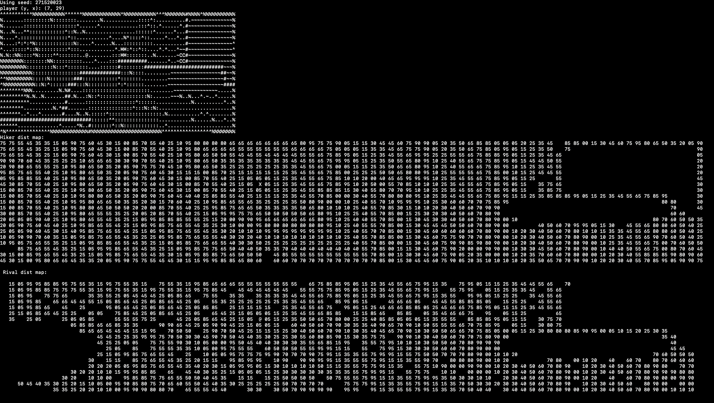
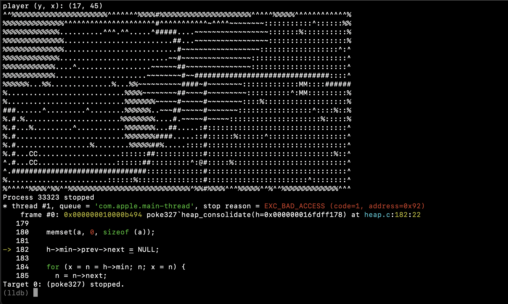

# Description
An ACII game a lot like Pokemon.

## Usage

```zsh
% make
# This makes the executable file "poke327"

% ./poke327
# This runs the program
```
## Output

## Bugs
 - crashes randomly because of heap accessing something out of reach.

